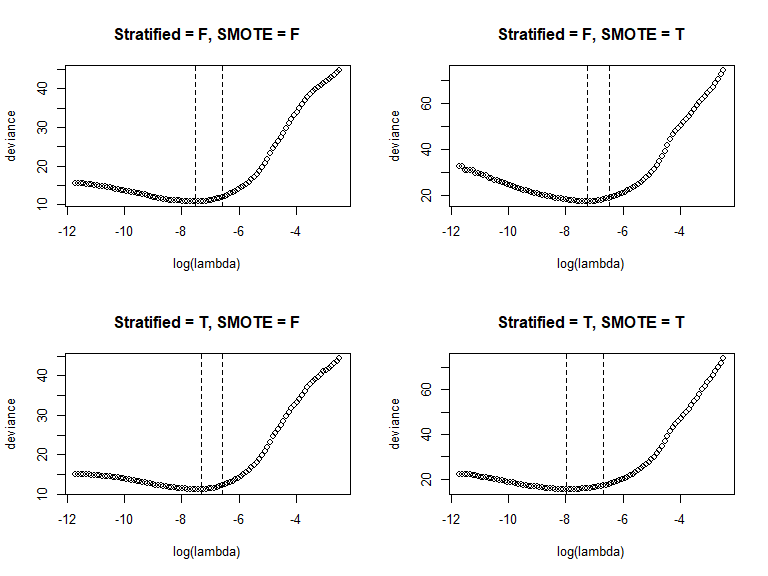

<!-- README.md is generated from README.Rmd. Please edit that file -->

# ImbLassoRcpp

<!-- badges: start -->

[](https://github.com/UofUEpiBio/ImbLassoRcpp/actions)
<!-- badges: end -->

The goal of ImbLassoRcpp is to handle imbalanced distribution in the
binary outcome by employing stratified cross-validation and/or SMOTE

## Installation

You can install the development version of ImbLassoRcpp like so:

``` r
# install.package("devtools")
devtools::install_github("Haojia-biostat/ImbLassoRcpp")
```

## Example

### 0. Preparation

I am going to apply the functions included in the `ImbLassoRcpp` package
to the data edited based on the `Vehicle` from `mlbench` package. The
details of the original dataset can be found
[here](https://search.r-project.org/CRAN/refmans/mlbench/html/Vehicle.html).

In order to construct a dataset with imbalanced distributed binary
outcome, I collapsed all the three categories in the `Vehicle$Class`
other than “bus” together, and randomly removed 150 observations from
the “bus” category. In this way, the data now has 9.8% (\<10%) of
observations with “bus” class.

``` r
library(mlbench)
data("Vehicle")

# table(Vehicle$Class)
# bus opel saab  van 
# 218  212  217  199

bus_id <- which(Vehicle$Class == "bus")

set.seed(7045)
imbdata <- Vehicle[-sample(bus_id, 150),]
y <- as.integer(imbdata$Class == "bus")
# mean(y) # 0.09770115

X <- data.frame(lapply(imbdata[,which(colnames(imbdata) != "Class")], scale))
```

``` r
library(ImbLassoRcpp)

# construct data with consideration of stratified cv and SMOTE
cv_smote_data_list <- list(
  # without stratified for cross-validation and without SMOTE (reference)
  stratified_cv_smote(as.matrix(X), y, stratified = F, SMOTE = F),
  # without stratified for cross-validation and with SMOTE
  stratified_cv_smote(as.matrix(X), y, stratified = F, SMOTE = T),
  # with stratified for cross-validation and without SMOTE
  stratified_cv_smote(as.matrix(X), y, stratified = T, SMOTE = F),
  # with stratified for cross-validation and with SMOTE
  stratified_cv_smote(as.matrix(X), y, stratified = T, SMOTE = T)
)
# do parallel computing for parameter tuning of lambda
smote_cv_lasso_list <- lapply(cv_smote_data_list, par_smote_cv_lasso)
```

### 1. Parameter tuning

``` r
par(mfrow = c(2,2))
plot.cv.smote.lasso(smote_cv_lasso_list[[1]], main = "Stratified = F, SMOTE = F")
plot.cv.smote.lasso(smote_cv_lasso_list[[2]], main = "Stratified = F, SMOTE = T")
plot.cv.smote.lasso(smote_cv_lasso_list[[3]], main = "Stratified = T, SMOTE = F")
plot.cv.smote.lasso(smote_cv_lasso_list[[4]], main = "Stratified = T, SMOTE = T")
```



``` r
# print.cv.smote.lasso(smote_cv_lasso_list[[1]])
# print.cv.smote.lasso(smote_cv_lasso_list[[2]])
# print.cv.smote.lasso(smote_cv_lasso_list[[3]])
print.cv.smote.lasso(smote_cv_lasso_list[[4]])
#> $`lambda input`
#> [1] 8.3296e-06 8.3296e-02
#> 
#> $`lambda tuned`
#>   lambda_min   lambda_1se 
#> 0.0003441801 0.0012660251 
#> 
#> $deviance
#>      min  min+1se 
#> 15.34498 16.98699
```

### 2. Final model

``` r
# summary.cv.smote.lasso(smote_cv_lasso_list[[1]])
# summary.cv.smote.lasso(smote_cv_lasso_list[[2]])
# summary.cv.smote.lasso(smote_cv_lasso_list[[3]])
summary.cv.smote.lasso(smote_cv_lasso_list[[4]])
#> $lambda
#> [1] 0.001266025
#> 
#> $`penalized regression`
#> 
#> Call:  glmnet::glmnet(x = x$X, y = x$y, family = "binomial", lambda = sval) 
#> 
#>   Df  %Dev   Lambda
#> 1 13 78.23 0.001266
#> 
#> $`feature selected`
#>  [1] "Comp"         "Circ"         "D.Circ"       "Rad.Ra"       "Pr.Axis.Ra"  
#>  [6] "Max.L.Ra"     "Elong"        "Sc.Var.Maxis" "Ra.Gyr"       "Skew.maxis"  
#> [11] "Kurt.maxis"   "Kurt.Maxis"   "Holl.Ra"     
#> 
#> $`unpenalized regression`
#> 
#> Call:  stats::glm(formula = stats::as.formula(paste0("y ~", paste(feature_selected, 
#>     collapse = "+"))), family = "binomial", data = data.frame(x$X, 
#>     y = x$y))
#> 
#> Coefficients:
#>  (Intercept)          Comp          Circ        D.Circ        Rad.Ra  
#>      -8.9219       -1.8349        2.2546       -3.7718      -19.3519  
#>   Pr.Axis.Ra      Max.L.Ra         Elong  Sc.Var.Maxis        Ra.Gyr  
#>      11.2919       -1.1518      -15.8226        0.4081        0.6419  
#>   Skew.maxis    Kurt.maxis    Kurt.Maxis       Holl.Ra  
#>      -1.6126        2.0653       12.9527      -10.1878  
#> 
#> Degrees of Freedom: 695 Total (i.e. Null);  682 Residual
#> Null Deviance:       445.4 
#> Residual Deviance: 70.47     AIC: 98.47
```
